

	

	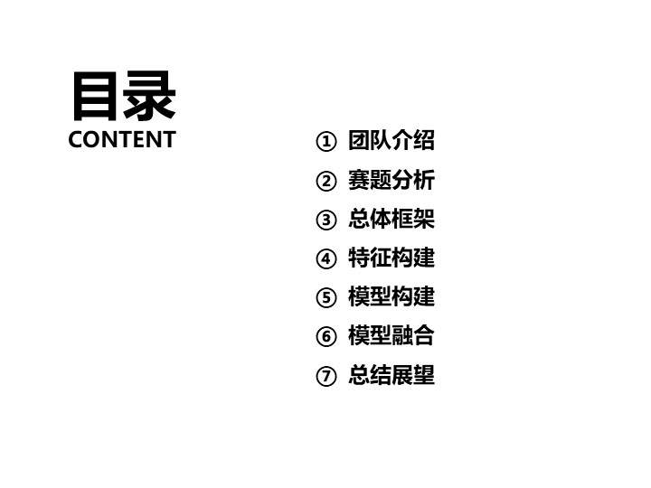

	

	

	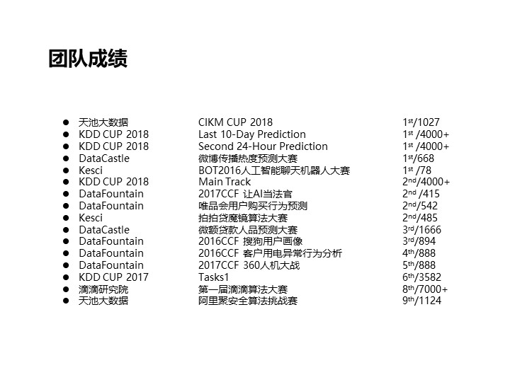

	

	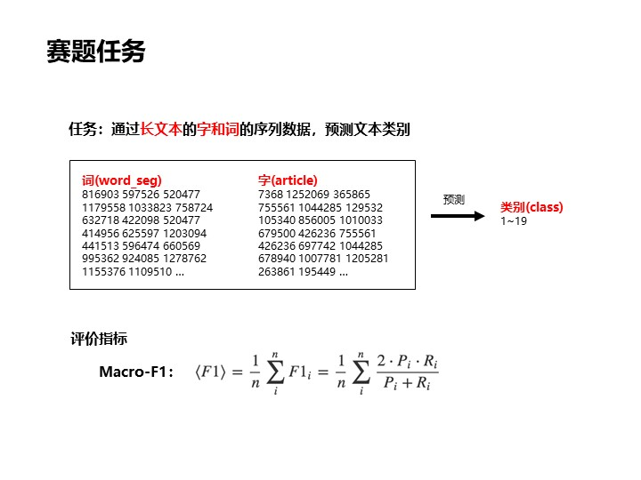

	

	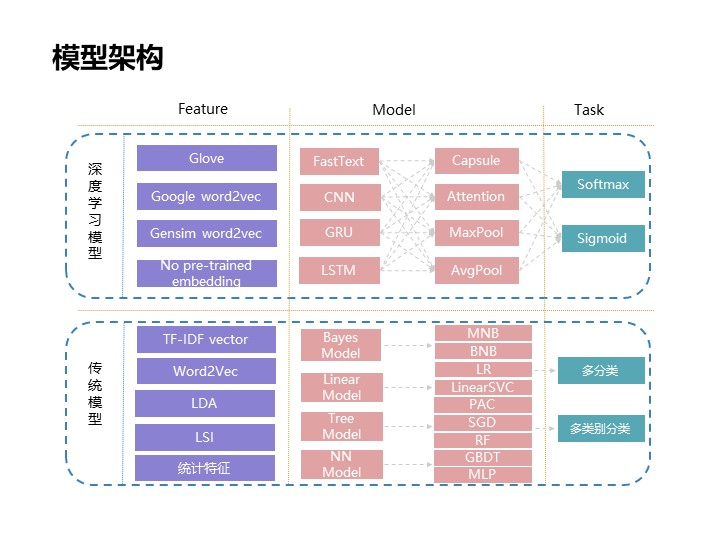

	

	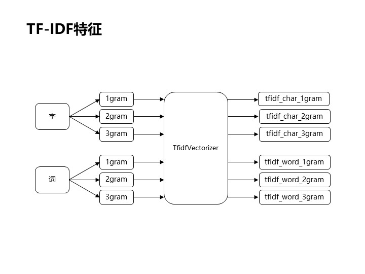

	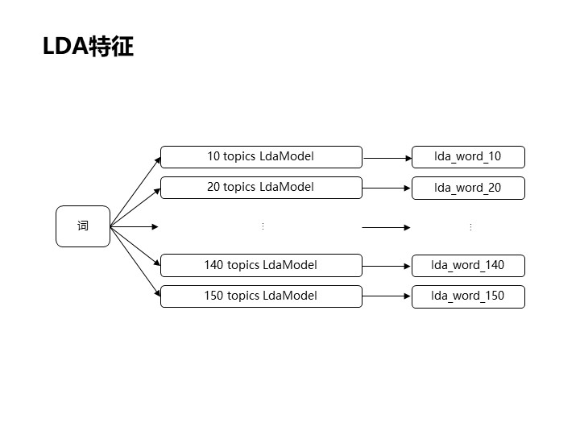

	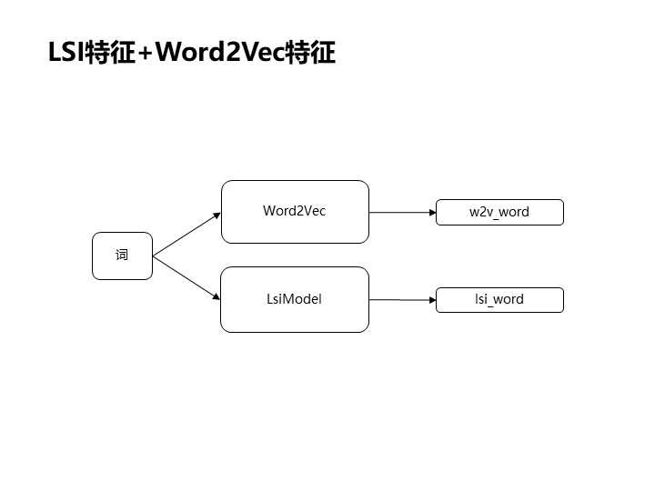

	

	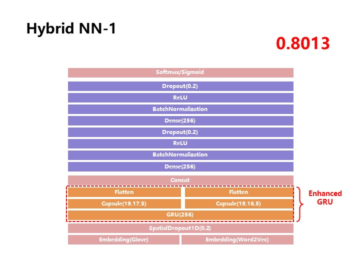

	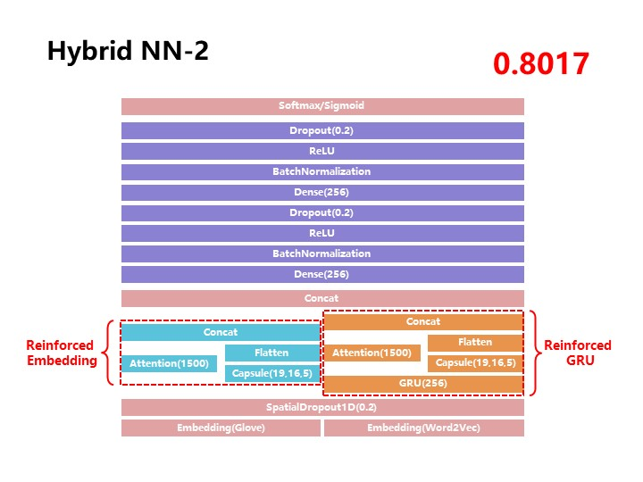

	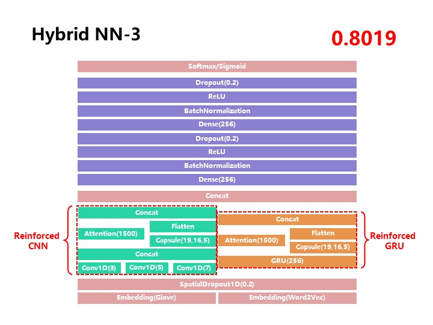

	

	

	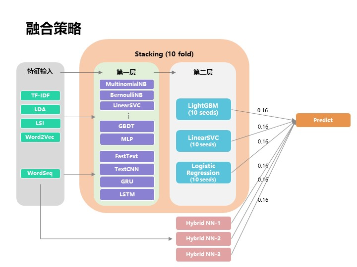

	

	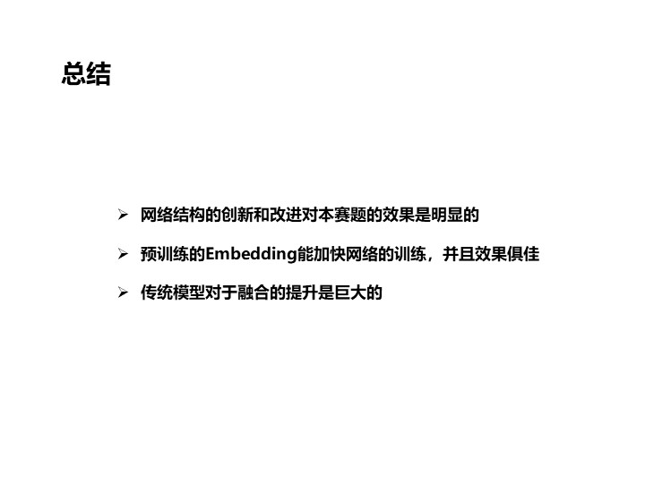

	

	

## 嘿！

如果您有任何的想法，例如：发现某处有 bug、觉得我对某个方法的讲解不正确或者不透彻、有更加有创意的见解，欢迎随时发 issue 或者 pull request 或者直接与我讨论！另外您若能 star 或者 fork 这个项目，在下感激不尽~